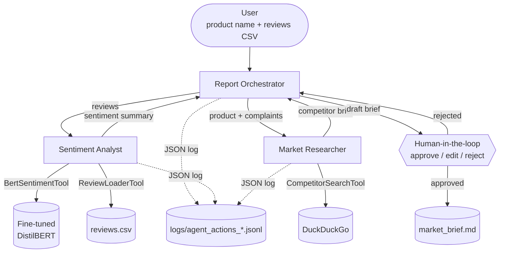

# System Architecture — Product Review Intelligence

> Multi-agent system, S8 Integrated Project, UIR 2025–2026.
> "Every component exists for a reason, every agent has a job, and you can explain why." — Project brief.

## 1. Problem framing

A product manager wants to understand how customers feel about their product **and** how it stacks up against competitors. Today this is done manually: scroll Amazon reviews, search competitor names, summarize. We automate this with three specialized agents that collaborate, with a human checkpoint before the brief is finalized.

## 2. Why a multi-agent design (and not one giant prompt)

| Problem with a single-agent / single-prompt approach | How multi-agent fixes it |
|---|---|
| One LLM call has to do classification, search, and writing — quality drops on each | Each agent gets a tight role + tool surface |
| No place to plug a *trained* DL model in a meaningful way | Sentiment Analyst owns the BERT tool |
| Hard to add a human checkpoint mid-flow | Orchestrator step naturally exposes it |
| Hard to debug what went wrong | Per-agent JSON logs make failures localized |

## 3. Agents

### 3.1 Sentiment Analyst (specialist 1)
- **Role**: Read raw reviews, classify each, surface recurring pain points and praise themes.
- **Why specialized**: Classification is structured and benefits from a fine-tuned model — letting an LLM do this would be slower, costlier, and less calibrated than our BERT.
- **Tools**:
  - `BertSentimentTool` — wraps our fine-tuned DistilBERT (the required DL model).
  - `ReviewLoaderTool` — loads CSV of reviews into a structured list.
- **Output schema**: `{"summary": str, "label_counts": {pos: int, neg: int}, "top_complaints": [str], "top_praise": [str]}`.

### 3.2 Market Researcher (specialist 2)
- **Role**: Given the product name + key complaints, scout competitors and gather public sentiment context.
- **Why specialized**: Web search + LLM-driven synthesis is a different skill from classification. Mixing them in one agent muddies prompts.
- **Tools**:
  - `CompetitorSearchTool` — DuckDuckGo (free, no key) returning top results with title/snippet/url.
- **Output schema**: `{"competitors": [{"name": str, "evidence": [str], "url": str}], "market_signals": [str]}`.

### 3.3 Report Orchestrator
- **Role**: Coordinator. Triggers the two specialists, synthesizes their outputs, asks the human for approval, exports the final brief.
- **Why specialized**: Synthesis + decision flow are LLM-native. The orchestrator never calls the BERT tool itself; it consumes the analyst's output. This separation of concerns is the whole point of the multi-agent design.
- **Tools**: none — pure synthesis from the other agents' outputs.
- **HITL**: a `human_input=True` task before the final brief is written. The user can approve, edit, or reject.

## 4. Communication diagram



## 5. Data flow

1. **Ingest** — User runs `python -m src.main --product "X" --reviews data/reviews.csv`.
2. **Plan** — Orchestrator builds a Crew with two sequential tasks: `analyze_reviews`, `scout_competitors`. Both feed the synthesis task.
3. **Analyze** — Sentiment Analyst loads CSV, calls BERT per row, aggregates. Each call is logged with `{agent, tool, input_hash, output, latency_ms}`.
4. **Scout** — Market Researcher queries DuckDuckGo for `"<product> alternatives"` and `"<top complaint> competitor"`.
5. **Synthesize** — Orchestrator drafts a 1-page market brief from the two outputs.
6. **HITL** — User sees the draft in the terminal and types: `approve` / edit text / `reject`. On reject, the orchestrator regenerates with feedback. (Hard cap: 2 retries before the run aborts.)
7. **Export** — Approved brief is written to `outputs/market_brief_<timestamp>.md` and a summary JSON to `outputs/run_<timestamp>.json`.

## 6. Tools — I/O schemas

Every tool uses a Pydantic schema for inputs (CrewAI `args_schema=...`). This gives us free validation and a self-documented contract.

| Tool | Input schema | Output |
|---|---|---|
| `BertSentimentTool` | `BertSentimentInput(text: str)` | `{"label": "positive"\|"negative", "score": float}` |
| `ReviewLoaderTool` | `ReviewLoaderInput(path: str, max_rows: int = 200)` | `[{"id": int, "text": str, "rating": int\|None}]` |
| `CompetitorSearchTool` | `CompetitorSearchInput(query: str, k: int = 5)` | `[{"title": str, "snippet": str, "url": str}]` |

## 7. Error handling & guardrails

- **Tool layer**: every `_run` is wrapped in try/except. Failures return a structured error dict, not raise.
- **LLM outputs**: if synthesis can't be parsed as a brief, orchestrator retries once with a stricter prompt; second failure → human gets an "abort or edit" prompt.
- **Input validation**: review CSV must have a `text` column; otherwise we fail fast with a clear message.
- **Rate limiting**: BERT inference is local (no rate limit). Gemini calls are sequential — not parallel — to stay under free-tier QPS.
- **Reproducibility**: random seeds set in training; `requirements.txt` pinned with `>=` floors per the brief's Python 3.10+ note.

## 8. Logging schema

One JSONL file per run, in `logs/agent_actions_<run_id>.jsonl`. Example record:

```json
{
  "ts": "2026-05-05T12:34:56.789Z",
  "level": "INFO",
  "logger": "agent.sentiment_analyst",
  "msg": "tool.call",
  "agent": "sentiment_analyst",
  "tool": "BertSentimentTool",
  "input_hash": "9f1c…",
  "output_label": "negative",
  "output_score": 0.93,
  "latency_ms": 28
}
```

## 9. Trade-offs we considered

- **Three agents vs five.** Five (loader + classifier + complaint extractor + searcher + writer) is "more multi-agent" but adds coordination cost without new capability. We picked three — the smallest count that justifies the architecture.
- **DistilBERT vs BERT-base.** DistilBERT trains in ~half the time on free Colab with ~1% accuracy loss. For a 4-week project this is the right trade.
- **DuckDuckGo vs Serper API.** DuckDuckGo is free, no key, fits the brief's "no personal spending". Serper would give cleaner JSON but costs money.
- **CrewAI vs LangGraph.** CrewAI is the brief's primary stack and has a built-in HITL via `human_input=True`. LangGraph is the stretch goal.

## 10. What we explicitly did *not* build (and why)

- A web UI — terminal HITL is enough to satisfy the brief and avoids a 3rd codebase.
- A vector store / RAG — not needed for this domain; reviews are passed directly.
- Multilingual sentiment — `amazon_polarity` is English; expanding scope would dilute the eval.
