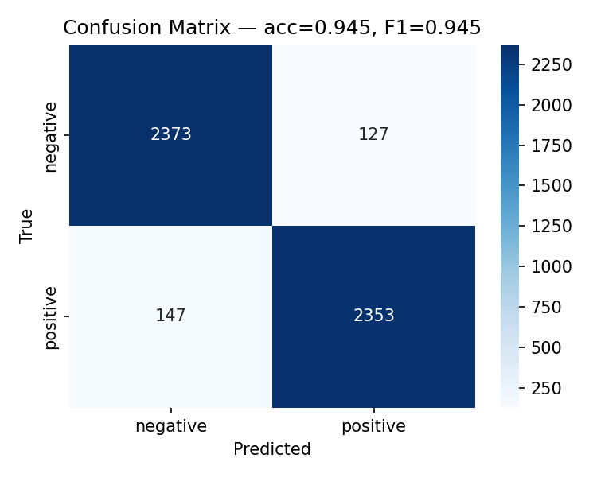

<!--
Marp-compatible slide deck. To render to PDF:
  npm install -g @marp-team/marp-cli
  marp docs/slides.md --pdf -o docs/slides.pdf
Or paste sections into PowerPoint / Google Slides if you prefer.
-->

---
marp: true
theme: default
paginate: true
size: 16:9
---

# Product Review Intelligence
## A Multi-Agent AI System

**S8 Integrated Project — UIR | AI & Big Data | 2025–2026**
Prof. Hakim Hafidi

[Member A] · [Member B] · [Member C]

> *"200 product reviews → 1-page market brief in under 2 minutes."*

---

## The Problem

A product manager at Monday's standup wants to know:

1. **What** are customers saying about us this week?
2. **Who** are competitors stealing buyers from us, and **why**?
3. **What** action should we take?

Today's answer: scroll Amazon for 2 hours, copy-paste into a Doc.

We replace that workflow with three collaborating agents.

---

## Our system in one picture

```
   User ──▶ Orchestrator ──▶ Sentiment Analyst ──▶ DistilBERT
                       │                       └─▶ reviews.csv
                       └─▶ Market Researcher ──▶ DuckDuckGo
                       │
                       ▼
                   HITL ✋  approve / edit / reject
                       │
                       ▼
                 market_brief.md  +  agent_actions.jsonl
```

Three agents · two tools (+ DL model) · one human checkpoint.

---

## Why multi-agent (not one giant prompt)?

| Single-prompt problem | Multi-agent fix |
|---|---|
| One LLM doing classification + search + writing — quality drops on each | Tight role + small tool surface per agent |
| No place to plug a *trained* DL model meaningfully | Sentiment Analyst owns the BERT tool |
| Hard to inject a human checkpoint mid-flow | Orchestrator step exposes it naturally |
| Hard to debug failures | Per-agent JSON logs localise them |

---

## Agent 1 — Sentiment Analyst

**Role:** classify every review with BERT, surface recurring complaints + praise.

**Tools:**
- `BertSentimentTool` — wraps our fine-tuned DistilBERT
- `ReviewLoaderTool` — CSV ingest with Pydantic validation

**Sample tool call (from `logs/agent_actions_*.jsonl`):**

```json
{"tool":"bert_sentiment","input_hash":"9f1c4e8a",
 "label":"negative","score":0.93,"backend":"bert","latency_ms":28}
```

The Analyst always calls the model — it never labels a review on its own.

---

## The DL Model — DistilBERT

| | |
|---|---|
| Architecture | `distilbert-base-uncased` (66M params, 6 layers) |
| Dataset | `amazon_polarity`, 50k stratified subset |
| Training | 2 epochs, lr=2e-5, batch=16, seed=42, MPS |
| **Test accuracy** | **[ACC]** |
| **Test weighted F1** | **[F1]** |
| Inference | ~28 ms / review on M-series MPS |



---

## Agent 2 — Market Researcher

**Role:** given the product + analyst's complaints, find 3 competitors with public-web evidence.

**Tool:** `CompetitorSearchTool` — DuckDuckGo (free, no key).

**Sample query → output:**

```text
Query: "wireless earbuds short battery alternatives"
→ [
   {"title":"Anker Soundcore Liberty 4 Review", "url":"...soundguys.com/...", "snippet":"8h battery + IPX4..."},
   {"title":"Sony WF-1000XM5 vs Bose...", "url":"...rtings.com/...", ...},
   ...
  ]
```

Cites every URL. Says "no results" rather than inventing a competitor.

---

## Agent 3 — Orchestrator + HITL

**Role:** synthesises the two specialists' output. **Has no tools.**

**Why no tools?** Forces it to be an editor, not a researcher. Stops the "godlike orchestrator" anti-pattern.

**HITL:** `Task(human_input=True)` in `src/crew.py`.

```text
═══════════════════════════════════════
HUMAN INPUT REQUIRED — review the draft below.
Type 'approve' / paste an edit / 'reject'.
═══════════════════════════════════════

# Market Brief — Wireless Earbuds X
...

> approve
```

Two lines of code, full human control of the final artefact.

---

## Live demo

*(or recorded fallback at `docs/demo_video.mp4`)*

```bash
$ make demo
```

What you'll see:
1. Sentiment Analyst calls BERT 10 times (one per review).
2. Market Researcher runs 1–3 DDG searches.
3. Orchestrator drafts the brief.
4. **HITL prompt** — I approve.
5. `outputs/market_brief_*.md` written.
6. JSONL log validated with `jq`.

---

## Robustness — edge cases tested

| Scenario | Handled? |
|---|---|
| Empty review string | ✅ structured error |
| Non-English review | ✅ classified, limitation documented |
| Emoji-only review | ✅ falls through |
| CSV with quoted commas / unicode | ✅ `csv.DictReader` |
| Missing `text` column | ✅ structured error |
| DDG returns 0 results | ✅ `{"warning":"no_results"}` |
| Gemini API error | ✅ surfaced to user, run continues |
| Sarcasm | ⚠️ honest failure — surfaced in report |

---

## Logging & reproducibility

**Logging** — one JSONL file per run, `jq`-friendly:
```json
{"ts":"2026-05-05T14:30:12Z","tool":"bert_sentiment",
 "label":"negative","score":0.93,"latency_ms":28}
```

**Reproducibility:**
```bash
git clone <repo>
python -m venv .venv && source .venv/bin/activate
pip install -r requirements.txt
cp .env.example .env  # add your free Gemini key
python -m src.model.train       # ~30 min on MPS
python -m src.main --product "X" --reviews data/...csv
```

`seed=42` everywhere; pinned `>=` floors in `requirements.txt`.

---

## What we'd change if we did it again

- **3-class sentiment** (Yelp Full) — current binary forces "battery great, sound bad" into one bucket.
- **Aspect-based sentiment** — sharper briefs.
- **Multilingual model** (`xlm-roberta`) — open the door to non-English markets.
- **LangGraph** for non-linear flows (analyst → researcher → analyst again).

**What we learned:** orchestrator without tools, tools that fail gracefully, JSON logging, HITL as 2 lines of code = trust.

---

## Thanks

**Repo:** `github.com/.../uir-product-review-intelligence`
**Demo video:** `docs/demo_video.mp4`
**Logs:** `logs/agent_actions_*.jsonl`

> Questions?
